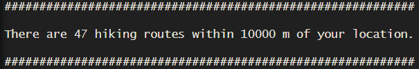
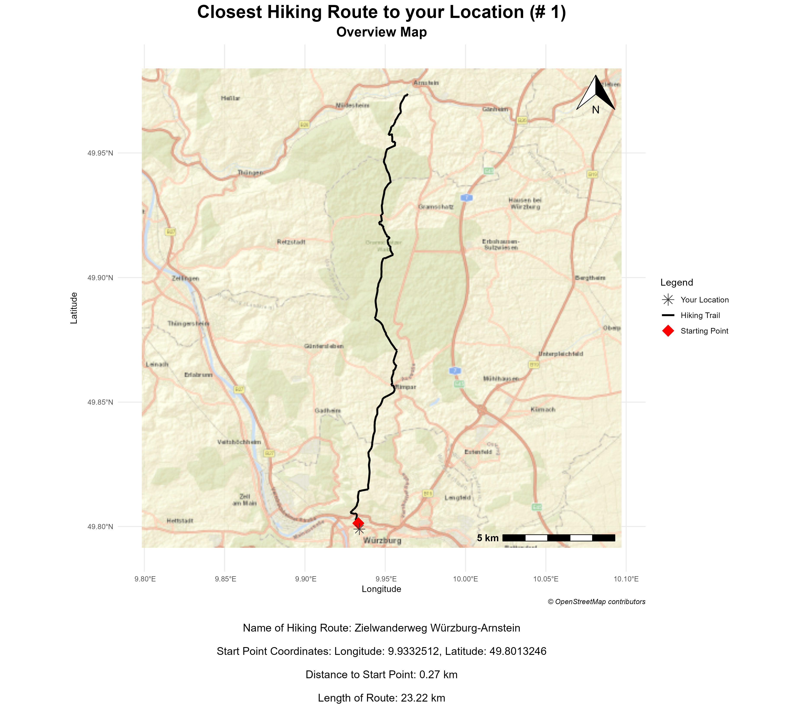

---
output:
  pdf_document: default
  html_document: default
---
# `hike4u`

<!-- README.md is generated from README.Rmd. Please edit that file -->

`hike4u` is an `R` package to plot the closest hiking route near you. It only uses open source data: hiking route data from *OpenStreetMap* and basemaps from *OpenStreetMap* and *Esri*. By defining your location through **longitude** and **latitude**, and adding a buffer size, you can retrieve hiking routes from the local walking network of *OSM*. By defining a closeness value, you can plot not only the closest hiking route to your location, but also the second closest, third closest, and so on. Your chosen route is ultimately plotted as an overview map and a satellite map. The first can be used to orient oneself, the second to see which kind of terrain is covered by the route. These two maps are exported to your working directory as `png` files. The package aims to ease the discovery of hiking routes close-by, to encourage exploring new areas, as well as to provide a tool for planning hiking trips.


## Installation


You can install the released version of `hike4u` from GitHub:

``` r
devtools::install_github("Elin-G/hike4u")
```


## Example

This example shows how easy it is to plot the closest hiking route near you.
A simple way to get the coordinates for a location you need is to use Google Maps. Right-click on the location and copy and paste them into the `hike4u` function.
A good buffer size to start with is 10000 meters. Do not choose a buffer size that is too small, as there might not be any hiking routes in that area. Additionally do not choose a buffer size that is too large, as the function will take longer to run, or your device might not be able to handle the request.
Set the closeness value to 1 for the first run of the function. You will receive a text in the Console, telling
you how many hiking routes are available in your selected buffer area. If you are not satisfied with the result, you can increase the closeness value to 2, 3, [...]. The function will then plot the second closest hiking route, the third closest hiking route, and so on.


**Example code:**
``` r
library(hike4u)

# Define you location by long and lat, define a buffer in meters and a closeness value
hike4u(9.93389691622025, 49.79895823510417, 10000, 1)
```


## Results

**Running the above mentioned example will print the following in your console:**




**The first map that will be plotted is an overview map of the closest hiking route to your location:**





**The second map that will be plotted is a satellite map of the closest hiking route to your location:**


